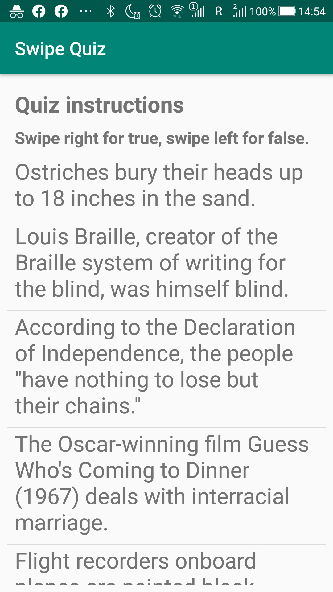
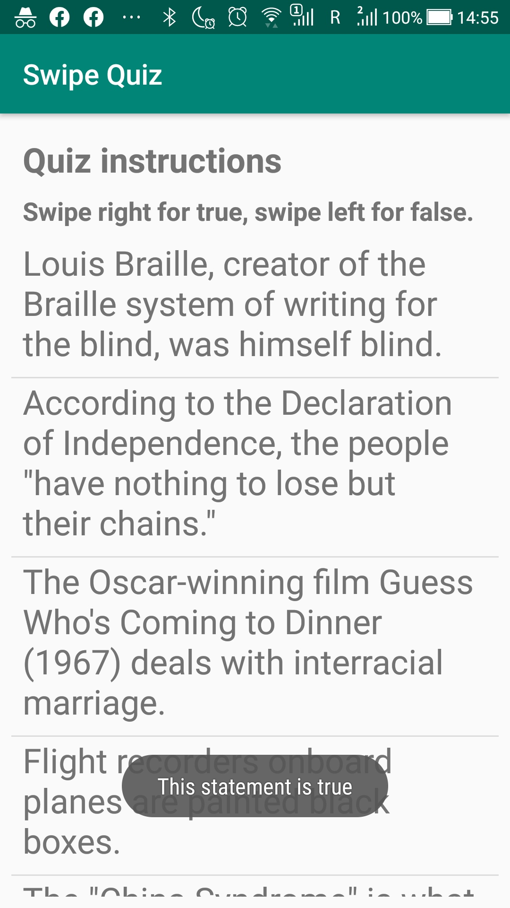
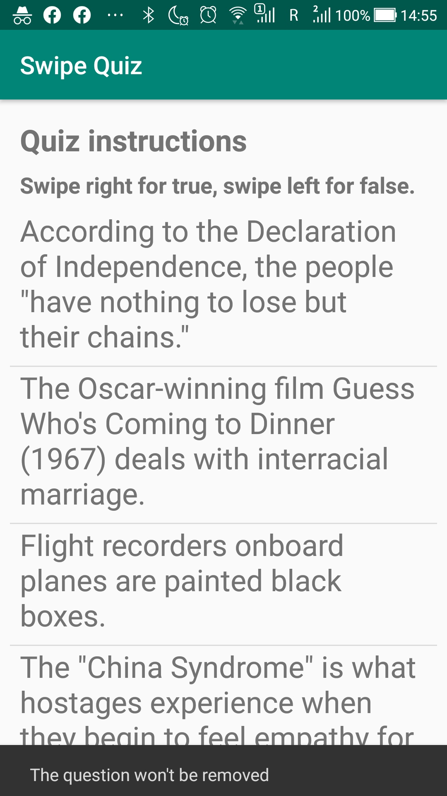
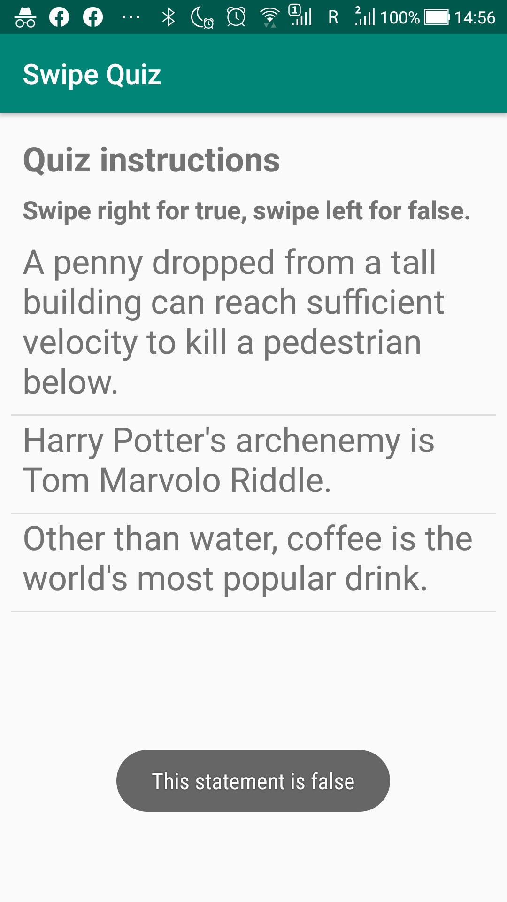

# Level 2 Learning Task 2 - Swipe Quiz
This is the second task of the second level. It is again somewhat similar to the example task of this level. However, this time we needed to use and distinguish between both swipe directions, and also work with both Snackbar and Toast messages. In all other aspects, the functionality is pretty similar to level2-example.
## What's inside
This is a quiz where a user can swipe the question to the left if he thinks the statement is incorrect or swipe the question to the right if he thinks the statement is correct. When a user swipes a question and the answer is correct then the question is removed from the list. Otherwise, the app gives feedback via a Snackbar message that the question will be not be removed from the list. If the user clicks on a question he or she gets feedback if the answer is correct or not. 
## Screenshots
    
    
